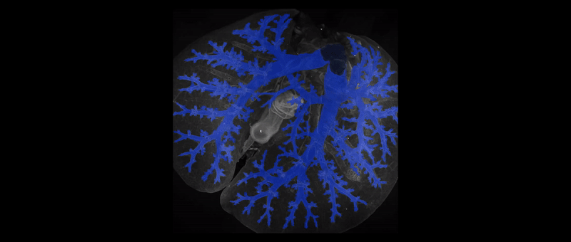

# Introduction

This repository contains the code for training the final nnU-Net based segmentation model for the publication "LungVis 1.0: an automatic AI-powered 3D imaging ecosystem unveils spatial profiling of nanoparticle delivery and acinar migration of lung macrophages," which is currently under review.

The nnU-Net model used for this publication includes modifications to the target spacing for the 3d_fullres configuration and introduces several changes to the data augmentation pipeline. These enhancements significantly increase the robustness of the network against the commonly observed image artifacts in our dataset. Specifically, we have adapted the standard nnU-Net framework for this particular use case, incorporating tailored augmentation techniques (detailed in the file located at [nnUNetTrainerV2_airwayAug](https://github.com/MIC-DKFZ/MurineAirwaySegmentation/blob/main/nnUNetTrainerV2_airwayAug.py)) and sampling strategies (specified at [airway_segmentation_planner.py](https://github.com/MIC-DKFZ/MurineAirwaySegmentation/blob/main/airway_segmentation_planner.py)) to better address the unique challenges presented by pulmonary imaging.

The data augmentation pipeline for training has been adapted to the relevant imaging artifacts present in the dataset. A custom slice illumination transform was used for simulating dark lung centers caused by illumination issues. Also blurring, contrast, brightness and sharpness transforms were applied locally in images to imitate blurred areas, halos, and different signal-to-noise ratios. Lastly, blank rectangle transforms were used to mimic missing information due to artifacts in the images. Using the additional augmentations, we were able to train a model that is highly robust.

# Installation
Our installation instructions make use of concrete git commit hashes for batchgenerators and nnU-Net in order to 
ensure reproducibility. Both repositories are under constant development and we cannot guarantee compatibility looking 
forward.

Some files from this repository must be copied to the nnU-Net source code! Follow the instructions and everything will 
work out just fine!

**This repository ONLY works with Linux operating systems and requires a GPU!**

1) Setup a new virtual environment. Pip or conda doesn't matter. If you don't know how, google will help. Or chatGPT. You decide.
2) Install [PyTorch](https://pytorch.org/get-started/locally/) for your setup. This repository was tested with version 2.0.0.
3) Install batchgenerators: `pip install git+https://github.com/MIC-DKFZ/batchgenerators#6859efd8cd59000896c0bcb6313e2b8e12bbb031`
4) Clone the nnU-Net code and install it:
   - Creates a local copy of the code: `git clone https://github.com/MIC-DKFZ/nnUNet.git`
   - Move into this repository: `cd nnUNet`
   - Set the repository to exactly the commit we need: `git checkout 3855c6e5eb27f69edbc656733e35c9c456c3a926`
   - Install with: `pip install -e .`
5) Now install the new components of this repository into nnU-Net:
   - copy `airway_segmentation_planner.py` into `nnunet/experiment_planning/`
   - copy `nnUNetTrainerV2_airwayAug.py` into `nnunet/training/network_training/`
6) Set the necessary nnU-Net environment variables according to [these instructions](https://github.com/MIC-DKFZ/nnUNet/blob/nnunetv1/documentation/setting_up_paths.md)

**Done!** Typically this installation process takes 5-10 minutes.

# Demo 
## Download the demo lung
Download the demo lung ITLI_007 from [here](https://zenodo.org/records/7413818/files/ITLI_007.zip?download=1) (590.3GB) and unzip the file.

## Convert the file to nnU-Net format
The raw lung data comes in tif format. Transform the raw lung ```ITLI_007/01_Raw imaging data_compressed/ITLI_007_raw_AF520nm_09-45-10.tif``` to nnU-Net format as described [here](https://github.com/MIC-DKFZ/nnUNet/blob/nnunetv1/documentation/dataset_conversion.md). You can use the provided `demo_convert_file.py` script by setting the path to your downloaded `ITLI_007` tif file. 

```commandline
python demo_convert_file.py
```

## Run the inference
Download the [Pretrained models](#pretrained-models) and follow the instructions in [Inference/Prediction](#inferenceprediction) to predict the airways of the lung.
The `FOLDER_WITH_INPUT_IMAGES` is the folder containing your converted lung file.
Running the inference requires one or multiple GPUs and takes more than an hour.
Expected output is the predicted airway segmentation that matches the airway segmentation in the folder ```ITLI_007/02_AI results```.


# Reproducing the Training
If you prefer to use our already trained models, see [Pretrained models](#pretrained-models)
## Data conversion

The data is published and can be downloaded here: https://zenodo.org/records/7413818.
To reproduce the training the data needs to be converted to nnU-Net format as described [here](https://github.com/MIC-DKFZ/nnUNet/blob/nnunetv1/documentation/dataset_conversion.md). For that you can execute the provided `data_conversion.py` script. Set the path in the script to the folder where you downloaded the zenodo data. It will automatically unzip the train cases, transform them to nifti and save them as an nnU-Net dataset in the respective directory for raw images that you have set (as described in the [installation](#installation) step 6).


## nnU-Net planning and preprocessing
Run the following:
```commandline
nnUNet_plan_and_preprocess -t 145 -pl2d None -pl3d AirwaySegPlanner -tl 2 -tf 1
```
This will take the raw data, perform nnU-Net's planning and preprocessing steps and save the preprocessed training data. The parameter "-t 145" identifies the dataset number for which planning and preprocessing are to be performed (we specified this number in the data [conversion script](https://github.com/MIC-DKFZ/MurineAirwaySegmentation/blob/main/data_conversion.py)). The option "-pl2d None" specifies that a 2D model is not planned, while "-pl3d AirwaySegPlanner" indicates the planning for a 3D model using the modified airway segmentation planner found in [airway_segmentation_planner.py](https://github.com/MIC-DKFZ/MurineAirwaySegmentation/blob/main/airway_segmentation_planner.py). The settings "-tl 2 -tf 1" are used to limit the number of processes to a small number because the files are large, and we aim to minimize the risk of running out of RAM.

We are now ready to run the training for the 3D full resolution model using the [nnUNetTrainerV2_airwayAug](https://github.com/MIC-DKFZ/MurineAirwaySegmentation/blob/main/nnUNetTrainerV2_airwayAug.py) trainer, which includes necessary adjustments for augmentation techniques tailored to the specific data artifacts we observed. Run the following to train the 5-fold cross-validation:
```commandline
nnUNet_train 3d_fullres nnUNetTrainerV2_airwayAug 145 0 -p AirwaySegPlanner
nnUNet_train 3d_fullres nnUNetTrainerV2_airwayAug 145 1 -p AirwaySegPlanner
nnUNet_train 3d_fullres nnUNetTrainerV2_airwayAug 145 2 -p AirwaySegPlanner
nnUNet_train 3d_fullres nnUNetTrainerV2_airwayAug 145 3 -p AirwaySegPlanner
nnUNet_train 3d_fullres nnUNetTrainerV2_airwayAug 145 4 -p AirwaySegPlanner
```
The command nnUNet_train will execute training on the 3d_fullres model using the adjusted trainer nnUNetTrainerV2_airwayAug. It will process the dataset identified by number 145, across each fold (from 0 to 4). The option -p AirwaySegPlanner specifies the planner with adjusted sampling strategies.

You can also run these simultaneously if you have multiple GPUS:
```commandline
CUDA_VISIBLE_DEVICES=0 nnUNet_train 3d_fullres nnUNetTrainerV2_airwayAug 145 0 -p AirwaySegPlanner &
CUDA_VISIBLE_DEVICES=1 nnUNet_train 3d_fullres nnUNetTrainerV2_airwayAug 145 1 -p AirwaySegPlanner &
CUDA_VISIBLE_DEVICES=2 nnUNet_train 3d_fullres nnUNetTrainerV2_airwayAug 145 2 -p AirwaySegPlanner &
CUDA_VISIBLE_DEVICES=3 nnUNet_train 3d_fullres nnUNetTrainerV2_airwayAug 145 3 -p AirwaySegPlanner &
CUDA_VISIBLE_DEVICES=4 nnUNet_train 3d_fullres nnUNetTrainerV2_airwayAug 145 4 -p AirwaySegPlanner &
wait
```

IMPORTANT: Wait with starting the last 4 folds (1, 2, 3, 4) until the training of the first fold has started using the 
GPU. This is related to unpacking the training data which can only be done by one nnU-Net process (it would result in 
read/write conflicts if several were to do this simultaneously).

# Inference/Prediction
Once training for all 5 folds is completed, you can use the trained models to perform predictions on new images. For that, 
the images must again be converted into nnU-Net format. See the [demo](#demo) for an example of converting a single file.
After conversion, prediction can be run like that:

```commandline
nnUNet_predict -i FOLDER_WITH_INPUT_IMAGES -o OUTPUT_FOLDER -t 145 -f 0 1 2 3 4 -m 3d_fullres -p AirwaySegPlanner -tr nnUNetTrainerV2_airwayAug --num_threads_preprocessing 1
```
The images are large. This will take a while. If you have multiple GPUs at your disposal, use the following (example assumes you have 4 GPUs):
```commandline
CUDA_VISIBLE_DEVICES=0 nnUNet_predict -i FOLDER_WITH_INPUT_IMAGES -o OUTPUT_FOLDER -t 145 -f 0 1 2 3 4 -m 3d_fullres -p AirwaySegPlanner -tr nnUNetTrainerV2_airwayAug --num_threads_preprocessing 1 --num_parts 4 --part_id 0 & 
CUDA_VISIBLE_DEVICES=1 nnUNet_predict -i FOLDER_WITH_INPUT_IMAGES -o OUTPUT_FOLDER -t 145 -f 0 1 2 3 4 -m 3d_fullres -p AirwaySegPlanner -tr nnUNetTrainerV2_airwayAug --num_threads_preprocessing 1 --num_parts 4 --part_id 1 & 
CUDA_VISIBLE_DEVICES=2 nnUNet_predict -i FOLDER_WITH_INPUT_IMAGES -o OUTPUT_FOLDER -t 145 -f 0 1 2 3 4 -m 3d_fullres -p AirwaySegPlanner -tr nnUNetTrainerV2_airwayAug --num_threads_preprocessing 1 --num_parts 4 --part_id 2 & 
CUDA_VISIBLE_DEVICES=3 nnUNet_predict -i FOLDER_WITH_INPUT_IMAGES -o OUTPUT_FOLDER -t 145 -f 0 1 2 3 4 -m 3d_fullres -p AirwaySegPlanner -tr nnUNetTrainerV2_airwayAug --num_threads_preprocessing 1 --num_parts 4 --part_id 3 &
wait 
```
The command nnUNet_predict initiates the prediction phase of the nnU-Net framework using the 3d_fullres model configuration, which operates on high-resolution 3D data. The -i FOLDER_WITH_INPUT_IMAGES and -o OUTPUT_FOLDER parameters specify the directories for input images and output segmentation results, respectively. The -t 145 parameter designates the specific dataset identity used for the predictions, ensuring consistency with previously trained models. The use of -tr nnUNetTrainerV2_airwayAug indicates that the predictions will employ a trainer adjusted for specific augmentation techniques relevant to airway segmentation. The --num_threads_preprocessing 1 sets the number of threads for preprocessing to 1, controlling parallelism during data loading and preprocessing steps. The --num_parts 4 and --part_id 0 divide the prediction task into 4 parts and indicate that only the first part will be processed in this run, which is useful for managing memory usage or parallel processing.
Inference will need a lot of RAM! >=128GB is a must!

# Pretrained models
Pretrained models are available [here](https://zenodo.org/record/7892040). To use them, simply download the .zip file 
and install it with 
`nnUNet_install_pretrained_model_from_zip` (use -h for usage instructions). Then follow the instructions in 
[Inference/Prediction](#inferenceprediction).

# Acknowledgements
This is a joint project between [Helmholtz Imaging](http://helmholtz-imaging.de) 
(located at [DKFZ](https://www.dkfz.de/en/mic/index.php)) and [Helmholtz Munich](https://www.helmholtz-munich.de/en).


